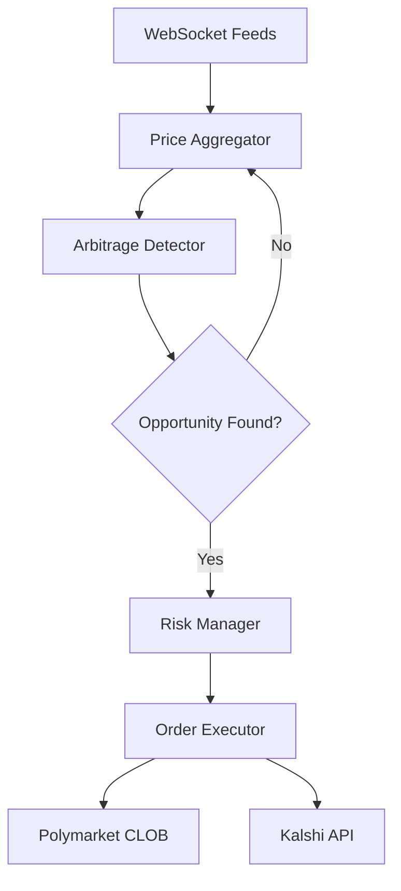

# 🤖 Polymarket-Kalshi Arbitrage Bot

**High-performance, production-ready arbitrage trading system written in Rust.**


## 🌟 Overview

This bot monitors price discrepancies between **Polymarket** (Polygon-based prediction market) and **Kalshi** (US-regulated prediction market), executing risk-free arbitrage opportunities in real-time with sub-millisecond latency.

### How Arbitrage Works

When the combined cost of opposing positions on the same event is less than $1.00, a risk-free profit opportunity exists:

| Platform | Position | Price |
|----------|----------|-------|
| Polymarket | YES | $0.42 |
| Kalshi | NO | $0.55 |
| **Total** | | **$0.97** |
| **Profit** | | **$0.03 (3.09%)** |

At market expiry, one side always pays out $1.00, guaranteeing profit.

## 🚀 Features

| Feature | Description |
|---------|-------------|
| ⚡ **High Performance** | Written in Rust with async/await for maximum speed |
| 🔌 **WebSocket Feeds** | Real-time price updates from both platforms |
| 🧮 **SIMD Detection** | Vectorized arbitrage calculations |
| 🔒 **Circuit Breakers** | Automatic safety mechanisms to prevent losses |
| 📊 **Position Tracking** | Real-time P&L monitoring |
| 🔐 **Secure** | Private keys never leave your machine |

## 📦 Project Structure

```
src/
├── main.rs              # Entry point
├── config.rs            # Configuration loader
├── polymarket/          # Polymarket client & CLOB
├── kalshi/              # Kalshi client
├── arbitrage/           # Core detection & execution logic
├── types.rs             # Shared data structures
└── utils/               # Helpers (circuit breaker, cache, etc.)

.env                     # API keys (never commit!)
Cargo.toml               # Rust dependencies
```

## ⚡ Quick Start

### Prerequisites

1. **Rust** (1.75+): Install via [rustup](https://rustup.rs/)
   ```bash
   curl --proto '=https' --tlsv1.2 -sSf https://sh.rustup.rs | sh
   ```

2. **API Keys**:
   - Polymarket: API Key, Secret, Passphrase, Private Key
   - Kalshi: Email/Password or API Key/Secret

### Installation

```bash
# Clone the repository
git clone https://github.com/yourusername/polymarket-kalshi-arbitrage-bot.git
cd polymarket-kalshi-arbitrage-bot

# Configure environment
cp .env.example .env
# Edit .env with your API keys

# Build in release mode (optimized)
cargo build --release

# Run the bot
cargo run --release
```

### Dry Run Mode

To test without executing real trades:
```bash
DRY_RUN=true cargo run --release
```

## 🔧 Configuration

Edit `.env` to configure the bot:

```env
# Polymarket
POLYMARKET_API_KEY=your_api_key
POLYMARKET_SECRET=your_secret
POLYMARKET_PASSPHRASE=your_passphrase
POLYMARKET_PRIVATE_KEY=your_wallet_private_key
POLYGON_RPC_URL=https://polygon-rpc.com

# Kalshi
KALSHI_EMAIL=your_email
KALSHI_PASSWORD=your_password

# Bot Settings
MIN_PROFIT_THRESHOLD=0.02  # 2% minimum profit
MAX_POSITION_SIZE=100      # Max $100 per trade
DRY_RUN=false
LOG_LEVEL=INFO
```

## 🏗️ Architecture



## ⚠️ Disclaimer

> **IMPORTANT**: This bot executes real trades with real money. Use at your own risk.
>
> - Never share your API keys or private keys.
> - Start with small position sizes.
> - Monitor the bot closely during initial runs.
> - Ensure you comply with all applicable laws and platform terms of service.

## 📝 License

MIT License. See [LICENSE](LICENSE) for details.

---

**Built with ❤️ and Rust**
